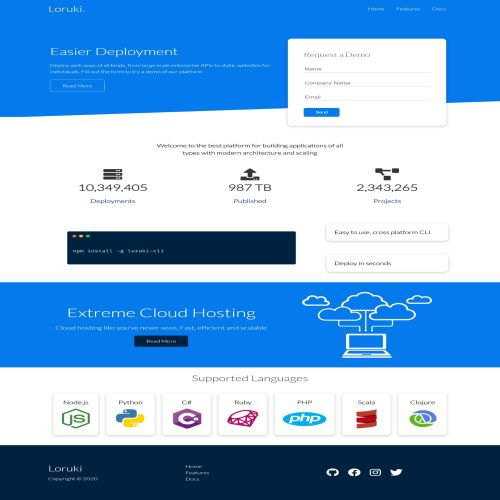
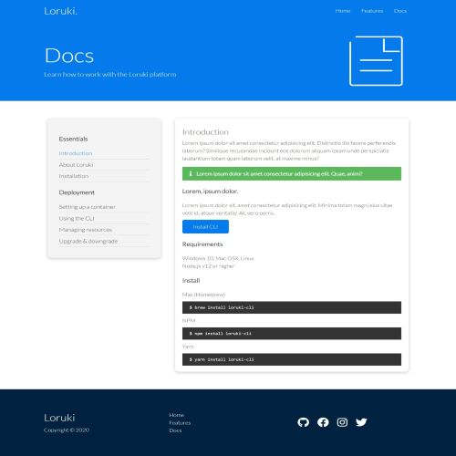

 
  Incremental Development

  

  <!-- <a href="https://Project Definition.netlify.app">Demo</a> -->

<h1 align="center">Project Definition</h1>

  

  

  

  

  <!--  -->

  <!--  -->

  <!--  -->

<!-- Status -->

<!-- <h4 align="center"> 
	🚧  Incremental Development 🚀 Under construction...  🚧
</h4> 

 -->

  <a href="#about">About</a> &#xa0; | &#xa0; 
  <a href="#technologies">Technologies</a> &#xa0;| &#xa0;
  <a href="#screenshoot">Screenshoot</a> &#xa0;| &#xa0;
  <a href="https://bringmetheaxx.github.io/TeamFour/" target="_blank">Contributor</a>&#xa0; |
  <a href="#license">License</a> &#xa0; | &#xa0;

 

## About 

This is a simple project where we tried to rebuild the [Loruki-website](https://zen-carson-c10c9f.netlify.app/) as the way of practcing the strategy for developing software 

## Technologies 

The following tools were used in this project:

- VScode
- GitHub
- Git
- Html
- CSS
- Slack

## Screenshoots

## Contributors:
* [Bringmetheaxx](https://github.com/bringmetheaxx)
* [Daniel Halasz](https://github.com/danielhalasz)
* [Moamin-AbuEwaida](https://github.com/Moamin-AbuEwaida)
* [Laura-Ramirez](https://github.com/lauraramirez220612)
* [TatsianaRud](https://github.com/TatsianaRud)
* [Senait B](https://github.com/Senait-coding)
## License

This project is under license from MIT. For more details, see the [License](
https://github.com/bringmetheaxx/TeamFour/blob/main/LICENSE)

<a href="#top">Back to top</a>

